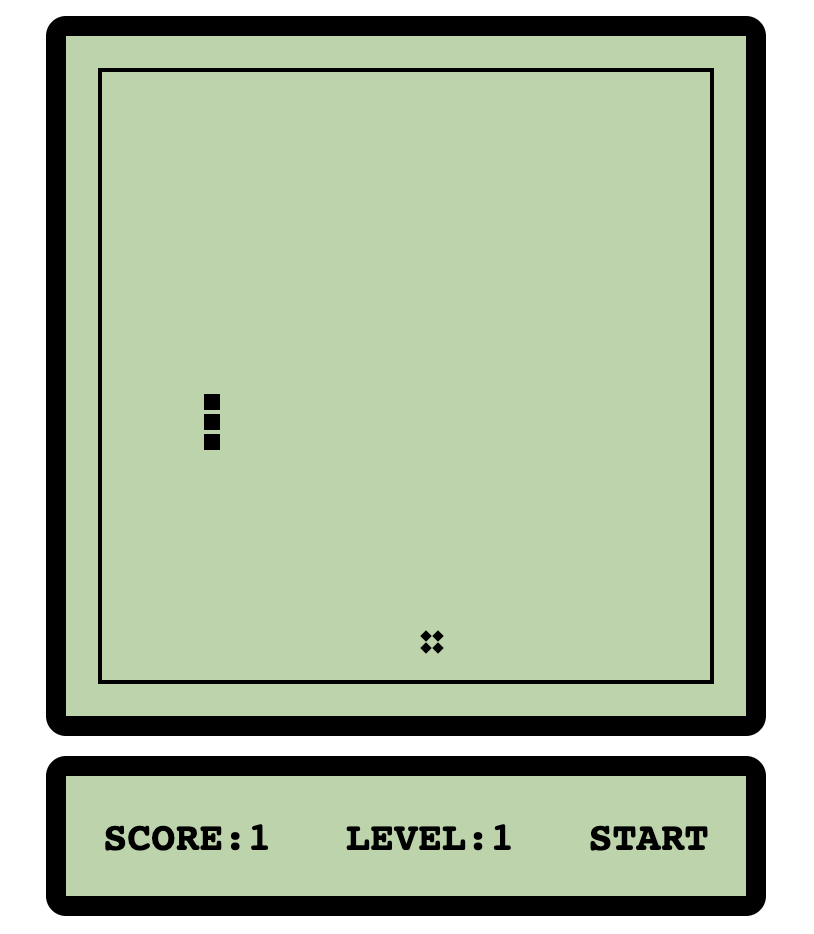

# 基于React的贪吃蛇小游戏 / Snake base on React :star:	

## 准备工作 / Set up
```
npm i #安装所有依赖 / install all dependencies
```
```
yarn start
```
visit localhost:3000

## 项目截图 / Screenshot


## 知识积累

### React
1. React中获取元素的样式
```
React中只能获取行内元素的样式，不能获取css文件中的样式，修改同理。eg.
box.style.left = "10px"
```
2. React中可以通过ref获取某个组件
```
<div ref={c=>this.xx = c}></div>
const{xx} = this
然后就可以愉快的操作啦
```
3. 父子元素通信 props，子调用父元素内容可以通过props回掉函数，父亲调用子，用ref获取到元素后直接调用即可
```
  startGame = ()=>{
    const {panel} = this //使用ref获取到panel组件
    panel.init(1000)  //直接调用子元素内部方法即可
  }
```
4. 记得react中全部使用箭头函数，否则this为undefined


### CSS
1. 布局使用flex布局来代替float     
     ```
     -开启flex: 
        display:flex
    ```
    ```
     -主轴对齐方式:
        justify-content: space-between | space-around | center | flex-start | flex-end;
    ```
    ```
     -辅轴对齐方式:
        align-content: flex-start | flex-end | center | space-between | space-around | stretch;
        *注意:属性定义了多根轴线的对齐方式。如果项目只有一根轴线，则该属性不启作用。
    ```
    ```
     -如果一条轴线排不下，如何换行
        flex-wrap: nowrap | wrap | wrap-reverse
        * nowrap 不换行
        * wrap 换行，第一行在上面
        * wrap-reverse: 换行，第一行在下面
     ```

### JS
1. 定时器
```
关闭定时器: clearInterval()
```
2. shift函数，方法从数组中删除第一个元素，并返回该元素的值。此方法更改数组的长度。
3. pop函数，删除数组最后一个元素